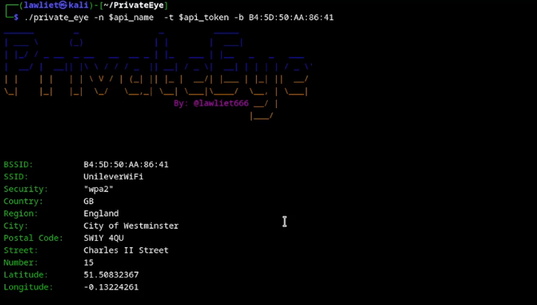
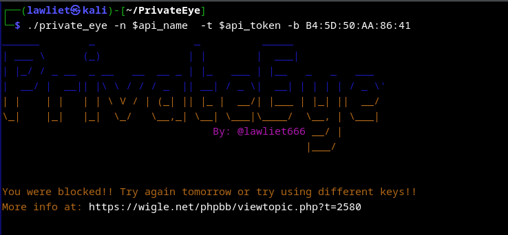

## private_eye

private_eye it's a simple osint tool.  
It uses the wigle.net api to query bssids world wide in order to find real addresses.  
Although it's not 100% exact. Wigle.net API privides execelente data for OSINT enthusiasts and ethical hackers alike.  

[Youtube Video](https://youtu.be/6nVQ5gNAgYs)

#### request restrictions
In order to avoid abuse and bots. Wigle.net limits new users to only 5 queries a day using the api.  
However it tends to aliviate this restriction after a few days.

For more information please refer to: [wigle.net forum](https://wigle.net/phpbb/viewtopic.php?t=2580)

